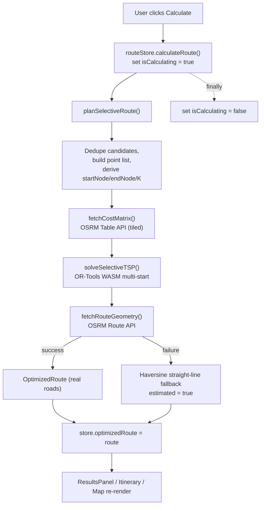

# Route Optimiser — Technical Documentation & User Guide

A complete, source-verified reference for the Route Optimiser project: what it is,
how it is engineered, how to run it, and how to use every feature in depth.

> **Scope note.** Everything in this document was verified directly against the
> source in this repository (not copied from the README). Where a fact matters,
> the relevant file is named so you can confirm it yourself.

---

## Table of Contents

1. [Overview](#1-overview)
2. [System Requirements](#2-system-requirements)
3. [Technology Stack (exact versions)](#3-technology-stack-exact-versions)
4. [Architecture](#4-architecture)
5. [Project Structure](#5-project-structure)
6. [Core Data Model](#6-core-data-model)
7. [The Optimization Engine (deep dive)](#7-the-optimization-engine-deep-dive)
8. [External Services & Networking](#8-external-services--networking)
9. [State Management & Persistence](#9-state-management--persistence)
10. [Cross-Origin Isolation & WebAssembly](#10-cross-origin-isolation--webassembly)
11. [Build & Bundle Pipeline](#11-build--bundle-pipeline)
12. [Configuration Reference](#12-configuration-reference)
13. [Running the Project Locally](#13-running-the-project-locally)
14. [Using the App — In-Depth Guide](#14-using-the-app--in-depth-guide)
15. [Input File Formats](#15-input-file-formats)
16. [Deployment](#16-deployment)
17. [Testing & Verification](#17-testing--verification)
18. [Performance, Limits & Resource Use](#18-performance-limits--resource-use)
19. [Error Handling & Resilience](#19-error-handling--resilience)
20. [Troubleshooting / FAQ](#20-troubleshooting--faq)
21. [Known Limitations & Technical Debt](#21-known-limitations--technical-debt)
22. [Repository Notes (vendored & dead files)](#22-repository-notes-vendored--dead-files)
23. [Glossary](#23-glossary)
24. [License](#24-license)

---

## 1. Overview

**Route Optimiser** is a 100% client-side (browser-only) route optimisation
application. You upload a list of geographic coordinates, and it answers two
questions at once:

1. **Which stops to visit** — select the best *K of N* (e.g. the best 20 of 100).
2. **In what order** — the shortest driving time or distance through them.

It then draws the route on a map and generates Google Maps navigation links.

- **No backend.** There is no origin server, database, or container. The entire
  optimiser runs in the browser tab.
- **Real optimisation.** Google OR-Tools (C++) is compiled to WebAssembly and
  executed locally to solve a *Selective Travelling Salesman Problem*.
- **Two external HTTP services** are used at runtime: OSRM (for real driving
  distances and road geometry) and Google Maps (for the navigation hand-off).

**Live deployment:** `https://syedtaimurhassan.github.io/optimiser/`

**Typical use case:** field logistics such as "here are ~100 e-bikes with low
batteries; pick the best 20 to collect and the optimal order to drive them."
(The included `samples/bikes_low_battery.json` is exactly this — 107 points.)

---

## 2. System Requirements

### To run/develop

- **Node.js ≥ 20.19** (or ≥ 22.12). Required by Vite 8. There is no `engines`
  field or `.nvmrc`; this floor comes from the Vite version in `package.json`.
- **npm** (a `package-lock.json` is committed, so npm is the assumed package
  manager).

### To use the app (end-user browser)

- A **Chromium-based browser** (recent **Chrome** or **Edge**) is strongly
  recommended. The optimiser uses threaded WebAssembly, which requires the page
  to be **cross-origin isolated** (`SharedArrayBuffer` available). See §10.
- If isolation cannot be established, the app shows a clear warning instead of
  failing silently (`solverWarning` in the store; surfaced in the header).
- An internet connection (for map tiles and the OSRM routing service).

---

## 3. Technology Stack (exact versions)

From `package.json`:

### Runtime dependencies
| Package | Version | Role |
| --- | --- | --- |
| `react` / `react-dom` | ^19.2.7 | UI runtime |
| `react-leaflet` | ^5.0.0 | React bindings for Leaflet |
| `leaflet` | ^1.9.4 | Interactive map |
| `zustand` | ^5.0.14 | State management (with persistence) |
| `or-tools-wasm` | ^0.9.1 | Google OR-Tools compiled to WebAssembly |
| `papaparse` | ^5.5.4 | CSV parsing |

### Development / build tooling
| Package | Version | Role |
| --- | --- | --- |
| `vite` | ^8.1.1 | Dev server + bundler (Rolldown-based) |
| `@vitejs/plugin-react` | ^6.0.3 | React fast-refresh / JSX |
| `@tailwindcss/vite` + `tailwindcss` | ^4.3.3 | Tailwind CSS v4 (no config file) |
| `vite-plugin-wasm` | ^3.6.0 | Import `.wasm` as ES modules |
| `vite-plugin-top-level-await` | ^1.6.0 | Support top-level `await` in WASM glue |
| `typescript` | ~6.0.2 | Type checking |
| `oxlint` | ^1.71.0 | Linting |
| `playwright` | ^1.61.1 | Browser automation (used for ad-hoc verification) |
| `gh-pages` | ^6.3.0 | Publish `dist/` to GitHub Pages |
| `esbuild` / `rollup` | ^0.28.1 / ^4.62.2 | Transitive build tooling |

There is **no** Redux, no router library, no CSS-in-JS, no test framework beyond
Playwright, and no state persistence library other than Zustand's built-in
`persist` middleware.

---

## 4. Architecture

### Execution model

- **Client-only SPA.** Entry is `index.html`, which (a) loads
  `public/coi-serviceworker.js` **first** to establish cross-origin isolation,
  then (b) loads `src/main.tsx` as an ES module.
- `src/main.tsx` mounts React 19 via `createRoot(...).render(<StrictMode><App/></StrictMode>)`.
- Execution is **asynchronous, single-threaded, cooperatively scheduled**:
  - The browser event loop is the scheduler.
  - React re-renders are *pushed* by the Zustand store (via `useSyncExternalStore`).
  - The optimisation pipeline is an `async` chain. The OR-Tools WASM is the
    **Asyncify** build, so long solves suspend/resume and yield to the event loop
    instead of freezing the tab.

### Design patterns in use

- **Unidirectional data flow / Flux** — a single Zustand store is the source of
  truth; components read via selectors and mutate only through named actions.
- **Pipeline (staged) pattern** — `src/lib/planRoute.ts` is a 3-stage pipe:
  cost matrix → solve → road geometry.
- **Ports & Adapters** — every external concern is isolated in `src/lib/`
  (OSRM adapter, Google Maps adapter, file parser, OR-Tools FFI). None import
  React or the store.
- **Strategy / Portfolio** — the solver runs a portfolio of interchangeable
  first-solution heuristics.
- **Repository via middleware** — persistence is handled by Zustand's `persist`
  middleware, not by business logic.

### Layering (strict inward dependency rule)

```
components/  (View)   ──▶  store/ (State)  ──▶  lib/ (Logic + adapters)  ──▶  external infra
   │                          │                     │                          (fetch, WASM, localStorage)
   └── read via selectors     └── call actions      └── pure / framework-free
```

Components never call OSRM or OR-Tools directly; they go through the store, which
calls `lib/`.

### Data flow of a "Calculate" request



---

## 5. Project Structure

```
optimiser/
├─ index.html                  App entry; loads coi-serviceworker then main.tsx
├─ vite.config.ts              Vite config (base path, plugins, build target)
├─ tsconfig.json               TS project references
├─ tsconfig.app.json           TS config for the app (target es2023, strict-ish)
├─ tsconfig.node.json          TS config for vite.config.ts
├─ .oxlintrc.json              oxlint rules
├─ package.json / package-lock.json
├─ public/
│  ├─ coi-serviceworker.js     Injects COOP/COEP headers for isolation
│  ├─ .nojekyll                Disables Jekyll on GitHub Pages
│  ├─ favicon.svg / icons.svg  Assets
├─ samples/                    Example inputs (see §15)
│  ├─ waypoints.csv            4 Copenhagen POIs (name,lat,lng)
│  ├─ waypoints.json           3 points [{lat,lng}]
│  └─ bikes_low_battery.json   107 points — the "100 bikes" scenario
├─ scripts/
│  └─ prune-wasm.mjs           Deletes unused OR-Tools WASM runtimes before deploy
├─ src/
│  ├─ main.tsx                 React root
│  ├─ App.tsx                  Responsive layout shell; warm-up trigger
│  ├─ index.css               Tailwind entry + Leaflet marker CSS
│  ├─ types.ts                 Shared data types
│  ├─ hooks/
│  │  └─ useMediaQuery.ts      Reactive media query (desktop vs mobile)
│  ├─ store/
│  │  └─ routeStore.ts         Zustand store: state + actions + persistence
│  ├─ lib/                     Framework-free core logic
│  │  ├─ solver.ts             OR-Tools multi-start Selective TSP (the engine)
│  │  ├─ planRoute.ts          Orchestrates matrix → solve → geometry
│  │  ├─ routingService.ts     OSRM Table & Route API adapter
│  │  ├─ googleMaps.ts         Google Maps URL builder + batching
│  │  ├─ parseFile.ts          CSV/JSON ingestion
│  │  ├─ coordinates.ts        Coordinate coercion/validation
│  │  └─ optimize.ts           Haversine distance (fallback)
│  └─ components/              UI (see below)
└─ or-tools-wasm-stable/       VENDORED build source of or-tools-wasm (not used at
                               runtime — the app depends on the npm package). See §22.
```

### Components (`src/components/`)

| Component | Responsibility |
| --- | --- |
| `Sidebar.tsx` | Layout: desktop left column / mobile draggable bottom sheet |
| `HeaderPanel.tsx` | Title, "Start over", solver isolation warning |
| `ColdStartBanner.tsx` | One-time "preparing optimizer" notice while WASM downloads |
| `StopsPanel.tsx` | Upload + active-stops section + "clear all" |
| `FileUploader.tsx` | Drag/drop + validation + inline error toast |
| `WaypointList.tsx` | Active stops list; per-row `⋮` action menu |
| `DeliveredPanel.tsx` | Delivered stops, restorable |
| `RouteSetupPanel.tsx` | Route options container (collapsible) |
| `RouteModeToggle.tsx` | Fixed-endpoints vs open route |
| `CoordinateForm.tsx` | Manual lat/lng entry + "Set on map" |
| `TargetKInput.tsx` | K (stops to visit) input with clamping |
| `ObjectiveToggle.tsx` | Optimise for Time vs Distance |
| `SearchQualityToggle.tsx` | Fast / Deep / Maximum search budget |
| `CalculatePanel.tsx` | Desktop Calculate button + status |
| `CalculateFab.tsx` | Mobile floating Calculate button |
| `CalculatingOverlay.tsx` | Glassmorphism "optimizing…" overlay on the map |
| `ResultsPanel.tsx` | Progress line + summary + itinerary |
| `RouteSummary.tsx` | Distance / duration / stop-count totals |
| `Itinerary.tsx` | Ordered remaining stops; delivery ticking; Maps links |
| `MapComponent.tsx` | Leaflet map, markers, polyline, hover-sync, map placement |
| `FavoritesPanel.tsx` | Save / load / delete named scenarios |
| `CollapsibleSection.tsx` | Reusable `<details>`-based disclosure |

---

## 6. Core Data Model

Defined in `src/types.ts`:

```ts
interface LatLng { lat: number; lng: number }               // the core shape everywhere

interface Stop extends LatLng {
  id: string          // stable UUID identity
  num: number         // stable display number — never renumbers on delete
  delivered: boolean  // delivery-workflow flag
}

interface Favorite {
  id: string; name: string
  startLocation: LatLng | null
  endLocation: LatLng | null
  waypoints: LatLng[] // stored as plain coords; reloading builds fresh Stops
}

interface OptimizedRoute {
  orderedWaypoints: LatLng[]  // start first, end last, intermediates reordered
  geometry: LineString        // GeoJSON [lng, lat] road geometry
  distanceMeters: number
  durationSeconds: number
  candidatesVisited: number   // excludes fixed start/end
  candidatesTotal: number
  estimated?: boolean         // true when using the straight-line fallback
}
```

**Key design point — stable identity.** A `Stop` carries both a UUID `id` and a
display `num` that never shifts when other stops are deleted. This is what keeps
the itinerary and delivery state consistent while the user edits the list.

---

## 7. The Optimization Engine (deep dive)

> ### ⚠️ This section is out of date, and has been since M9.
>
> It describes `src/lib/solver.ts` driving `or-tools-wasm` on the main thread.
> That has not been the app's solver since M9, and since M10 the arithmetic is
> not even JavaScript.
>
> **What is true now:**
>
> - Every engine sits behind `SolveRequest`/`SolveResult` in
>   [`src/lib/compute/solverPort.ts`](src/lib/compute/solverPort.ts). The matrix
>   is a flat `Int32Array`, not `number[][]`.
> - The shipping engine is **Rust compiled to wasm32** (`engine/`, ~49 KB),
>   running in a pool of workers. `src/lib/compute/registry.ts` picks it.
> - **OR-Tools is not in the production bundle at all.** It survives as a
>   dev-only oracle behind a dynamic import from `src/benchSeam.ts`, and
>   `npm run bench:verify-seam` fails the build if it ever leaks.
> - Cross-origin isolation is no longer required, so iOS Safari and Firefox work.
>
> Read the **M9** and **M10** entries in [PROGRESS.md](PROGRESS.md) for the
> current design and the measurements behind it. The rest of this section is
> retained as an accurate record of what the engine used to be, and of why the
> OR-Tools binding was abandoned — §7 on `firstSolutionStrategy` being the only
> forwarded parameter is still exactly right, and is still the reason.

The engine is `src/lib/solver.ts`. It solves a **Selective TSP**: choose a subset
of stops *and* order them, with fixed or open endpoints.

### 7.1 The augmented graph

For `n` real nodes (the ordered list `[start?, …candidates, end?]`), two virtual
depot nodes are added:

- `VS = n` — virtual start depot
- `VE = n + 1` — virtual end depot

The single vehicle is pinned `starts = [VS]`, `ends = [VE]`, so every tour is an
open **path** `VS → … → VE` (never a cycle).

### 7.2 The cost function

- real → real: `matrix[a][b]`
- `VS → b`: `0` if `startNode === null || b === startNode`, else `FORBIDDEN`
- `a → VE`: `0` if `endNode === null || a === endNode`, else `FORBIDDEN`
- anything else: `FORBIDDEN`

This single conditional encodes **all** endpoint modes with no special-casing:

| Start | End | Behaviour |
| --- | --- | --- |
| fixed | fixed | classic fixed-endpoint route |
| fixed | null | route must start at Start; ends at the best stop |
| null | fixed | best start; must end at End |
| null | null | fully open path (optimiser picks both) |

Constants: `SKIP_PENALTY = 10_000_000`, `FORBIDDEN = 1_000_000_000`.

### 7.3 Selecting K stops

- Each candidate (non-endpoint) node gets `AddDisjunction([node], SKIP_PENALTY)`,
  making it optional — skipping costs 10,000,000, which dwarfs any real arc.
- A capacity dimension named `StopCounter` caps visited candidates at `K`
  (demand 1 for candidates, 0 for endpoints/depots; vehicle capacity = K).

### 7.4 The search strategy (why it is a multi-start)

The installed `or-tools-wasm@0.9.1` binding forwards **only** two parameters to
the WASM solver: `firstSolutionStrategy` and `solution_limit`. The
`local_search_metaheuristic` (GLS) and `time_limit` fields exist in the
TypeScript types but are **never serialized** to the WASM — verified in the
compiled `node_modules/or-tools-wasm/build/javascript/node/routing.js`. So GLS
and an internal solver time-limit are **not achievable** with this dependency.

Quality is therefore produced in JavaScript, in `solveSelectiveTSP`:

1. **Portfolio pass** — try a set of construction heuristics once each and keep
   the best. `PORTFOLIO` (in order):
   `PATH_CHEAPEST_ARC`, `PARALLEL_CHEAPEST_INSERTION`,
   `SEQUENTIAL_CHEAPEST_INSERTION`, `LOCAL_CHEAPEST_INSERTION`,
   `GLOBAL_CHEAPEST_ARC`, `SAVINGS`, `PATH_MOST_CONSTRAINED_ARC`.
   > `BEST_INSERTION` and `CHRISTOFIDES` are **deliberately excluded**: in this
   > WASM build they can take **>12 seconds on a ~10-node model** (all others are
   > 5–8 ms), and a solve can't be interrupted mid-call, so one of them would
   > blow past the time ceiling.
2. **GRASP restart pass** — while budget remains, re-solve on a **noised** copy
   of the matrix (`NOISE_FRACTION = 0.25` of the mean arc) to diversify away from
   any single local optimum. Each result is scored on the **original** matrix.
3. **Objective** — `Σ real arcs + SKIP_PENALTY · (unvisited candidates)`, which
   mirrors OR-Tools' own objective, so runs are directly comparable.
4. **Early exit** — the budget is a **ceiling, not a fixed wait**. The restart
   pass stops after `patience = max(30, 3·n)` non-improving attempts (trivial
   inputs return in a few hundred ms even on the Maximum tier).
5. **Safety cap** — `MAX_ATTEMPTS = 400` total attempts.

**Time budget** is passed in from the UI (`timeBudgetMs`), defaulting to
`DEFAULT_TIME_BUDGET_MS = 3000`. The loop uses a `Date.now()` deadline and
`await`s a `setTimeout(0)` between solves so the UI keeps repainting.

**Verified quality:** on adversarial "cheap near-decoys vs. tight far-cluster"
instances (which trap single greedy), the multi-start beats single
`PATH_CHEAPEST_ARC` on every instance (~15% average, up to ~28% cheaper), and is
never worse (it includes the greedy strategy). On well-clustered inputs, single
greedy is already near-optimal and the portfolio ties it.

### 7.5 Warm-up & lifecycle

- `warmUpSolver()` is idempotent (promise-cached) and downloads/initialises the
  ~16 MB routing runtime once. It **throws** if `window.crossOriginIsolated` is
  false.
- `App.tsx` calls it **3 seconds after mount** (`setTimeout`), hiding the
  download behind user setup time. `setWorkerBridgeEnabled(false)` selects the
  single-threaded Asyncify runtime.

---

## 8. External Services & Networking

Adapter: `src/lib/routingService.ts`.

### OSRM (Open Source Routing Machine)

- **Table API** — `https://router.project-osrm.org/table/v1/driving/…` builds the
  N×N cost matrix (`annotations=duration` or `distance`).
- **Route API** — `https://router.project-osrm.org/route/v1/driving/…` returns
  GeoJSON road geometry + totals for the already-ordered sequence.
- **Coordinates are sent in the URL path** as `lng,lat;lng,lat;…` (note: OSRM is
  `lng,lat`, the reverse of Google Maps). So although optimisation is local,
  **coordinates are transmitted to the public OSRM demo server for routing.**

**Constraints and safeguards (exact values):**

| Constant | Value | Purpose |
| --- | --- | --- |
| `OSRM_TABLE_MAX_CELLS` | 10,000 | Public server caps sources×destinations per request |
| `MAX_TABLE_POINTS` | 300 | Client-side hard cap on input size |
| `OSRM_MIN_REQUEST_GAP_MS` | 1,100 | Delay between tiled requests (1 req/s policy) |
| `UNREACHABLE_COST` | 9,999,999 | Replaces `null` (unroutable) cells so the solver never sees NaN/Infinity |
| `fetchWithTimeout` | 30,000 ms | AbortController timeout with a friendly message |

**Tiling:** for large sets the matrix is fetched in horizontal row-bands —
`rowsPerRequest = floor(10000 / n)`, `totalRequests = ceil(n / rowsPerRequest)`.
All coordinates are sent every request; only the `sources` window changes.
Every cost is `Math.round()`-ed to an integer (OR-Tools requires integer costs).

### Google Maps hand-off

Adapter: `src/lib/googleMaps.ts`. Builds navigation URLs from the final order:

- `MAX_WAYPOINTS_PER_URL = 9` — Google's per-URL intermediate-waypoint limit.
- Longer routes are split into **chained batches**, where each batch's
  destination is the next batch's origin, so following them in order covers the
  whole route with no gaps.

---

## 9. State Management & Persistence

Store: `src/store/routeStore.ts` (Zustand + `persist` middleware).

### Source of truth

A single in-memory store. Components subscribe with narrow selectors (and
`useShallow` for object slices) so frequent status updates don't re-render the
map or itinerary.

### Persisted vs transient (via `partialize`)

- **Persisted** to `localStorage`: `startLocation`, `endLocation`, `waypoints`,
  `targetK`, `objective`, `optimizedRoute`, `favorites`, `routeMode`,
  `searchQuality`.
- **Transient (never persisted):** `isCalculating`, `calcStatus`, `routeError`,
  `solverReady`, `solverWarning`, `hoveredStopId`, `mapPlacementMode`.

### Durability & versioning

- Storage key: **`route-optimiser:v2`**, `version: 2`.
- A `migrate()` function upgrades pre-v2 waypoint shapes (older sessions where
  waypoints were plain `{lat,lng}` without a stable `id`/`num`).
- Because `optimizedRoute` is persisted, a completed route survives a page
  refresh. `localStorage.setItem` per key is atomic, so there are no torn writes.

### Notable derived state

`ResultsPanel` computes the "delivered in this route" count **inside** a selector
(intersecting the route's coordinates with delivered waypoints) rather than
storing it — progress updates live as stops are ticked, with no extra state.

---

## 10. Cross-Origin Isolation & WebAssembly

Threaded WebAssembly needs `SharedArrayBuffer`, which requires the page to be
**cross-origin isolated** (`Cross-Origin-Opener-Policy: same-origin` +
`Cross-Origin-Embedder-Policy`). GitHub Pages cannot send these response headers,
so the app ships a service worker.

- `public/coi-serviceworker.js` registers a service worker that intercepts fetches
  and **injects** `COOP: same-origin` and `COEP: credentialless` (the
  `credentialless` mode lets cross-origin resources like OpenStreetMap tiles load
  without CORP headers). On first load the SW registers and the page reloads once;
  afterwards `window.crossOriginIsolated === true`.
- `index.html` loads this script **before** the app.
- If isolation is unavailable, `warmUpSolver()` throws and the UI shows a warning
  telling the user to use a recent Chrome/Edge.

---

## 11. Build & Bundle Pipeline

### Vite config (`vite.config.ts`)

- `base: '/optimiser/'` — **must** match the GitHub repo name so Pages resolves
  assets. This affects **dev too** (see §13).
- Plugins (in order): `react()`, `tailwindcss()`, `wasm()`, `topLevelAwait()`.
- `build.target: 'es2022'` and `esbuild.target: 'es2022'` — ES2022 natively
  supports top-level `await`, so the WASM glue isn't down-levelled.
- `optimizeDeps.exclude: ['or-tools-wasm']` — the large prebuilt WASM is not
  pre-bundled.

### WASM pruning (`scripts/prune-wasm.mjs`)

`or-tools-wasm` emits many runtimes (cp_sat, mathopt, pdlp, graph, set_cover,
mp_solver, plus threaded/JSPI routing builds). The app only ever loads
`routing_runtime_asyncify`. The prune script deletes every other
`*_runtime*.(wasm|js)` from `dist/assets`, freeing ~141 MB. It runs automatically
in `predeploy`.

### TypeScript

- `tsconfig.app.json`: `target es2023`, `lib [ES2023, DOM]`, `moduleResolution
  bundler`, `jsx react-jsx`, `verbatimModuleSyntax`, `noUnusedLocals` +
  `noUnusedParameters`, `noEmit` (Vite emits, not tsc).
- `tsconfig.node.json`: for `vite.config.ts` (bundler resolution + synthetic
  default imports so the WASM/TLA plugins' default exports are callable).
- Note: tsc's `target` (es2023) is for type-checking; the **emitted bundle is
  ES2022** (Vite/esbuild target).

---

## 12. Configuration Reference

| File | What it controls |
| --- | --- |
| `vite.config.ts` | Base path `/optimiser/`, plugins, ES2022 output, dep exclusion |
| `tsconfig.app.json` | App type-checking (es2023, strict-ish, no-unused) |
| `tsconfig.node.json` | Type-checking for `vite.config.ts` |
| `.oxlintrc.json` | Lint: `react/rules-of-hooks: error`, `react/only-export-components: warn` |
| `package.json` scripts | dev / build / preview / lint / deploy (see §13, §16) |
| `public/.nojekyll` | Prevents GitHub Pages' Jekyll from ignoring underscore files |

**The base path is hard-coded in two places** — `vite.config.ts` (`base`) and
`index.html` (the absolute `/optimiser/coi-serviceworker.js` script src). If you
fork under a different repo name, change **both**.

---

## 13. Running the Project Locally

### Prerequisites

- Node.js ≥ 20.19 (or ≥ 22.12) and npm.

### Install

```bash
npm install
```

### Start the dev server

```bash
npm run dev
```

> **IMPORTANT — the app is served under `/optimiser/`, not `/`.**
> Because `base` is `/optimiser/`, Vite serves the app at
> **`http://localhost:5173/optimiser/`**. Visiting the bare root
> `http://localhost:5173/` returns a **302 redirect** to `/optimiser/`.
> (Verified against the running dev server.) Vite prints the correct URL in the
> "Local:" line — use that.

### Other scripts

| Command | What it does |
| --- | --- |
| `npm run dev` | Dev server with hot module reload at `http://localhost:5173/optimiser/`. |
| `npm run build` | `tsc -b` (type-check) then `vite build` → static bundle in `dist/`. |
| `npm run preview` | Serve the production `dist/` locally to sanity-check the build. |
| `npm run lint` | Run oxlint. |
| `npm run deploy` | `predeploy` (build + prune WASM) then publish `dist/` to GitHub Pages. |

### First-run browser notes

- On first load the **coi-serviceworker registers and the page reloads once** —
  this is expected and only happens the first time (or after a cache clear).
- The **optimizer WASM (~16 MB) downloads ~3 s after load**; a blue "Preparing
  the route optimizer…" banner shows until it's ready. You can add stops and set
  up your route while it downloads.

---

## 14. Using the App — In-Depth Guide

### 14.1 The layout

- **Desktop (≥ 768px):** map on the right, controls sidebar on the left with a
  pinned **Calculate** button at the bottom.
- **Mobile (< 768px):** full-screen map with a **draggable bottom sheet** of
  controls (tap or drag the handle to expand/collapse) and a floating
  **Calculate** button bottom-right.

### 14.2 Add stops (three ways)

1. **Upload a file** — drag a `.csv` or `.json` onto the dropzone, or click to
   browse. Invalid files (e.g. `.pdf`) are rejected with a red border and a
   dismissible error. Valid rows are imported; bad rows are skipped and counted.
   (See §15 for formats. Try `samples/waypoints.csv` or
   `samples/bikes_low_battery.json`.)
2. **Type coordinates** — under **Route options → Start/End**, enter latitude and
   longitude and click "Set".
3. **Click the map** — press **📍 Map** next to Start or End, then click a point
   on the map (a crosshair cursor and a hint banner appear; the sheet auto-collapses
   on mobile so the map is tappable).

### 14.3 Configure the route (Route options section)

- **Route type** — **Fixed ends** (you set a start and/or end) vs **Open route**
  (the optimiser chooses both endpoints; switching to Open clears any anchors).
- **Start / End** — optional. Leave one or both blank for open ends. You can set
  an anchor by typing coordinates, picking a stop from the list (via its `⋮`
  menu), or clicking the map.
- **Stops to visit (K)** — how many of the uploaded stops to actually visit. Blank
  = all. Values are clamped to `1…(number of stops)` on blur and again at
  calculation time.
- **Optimise for** — **Time** (driving duration) or **Distance** (road distance).
  This chooses which OSRM matrix is fetched.
- **Search quality** — the solver's time ceiling:
  - **Fast (~1 s)**, **Deep (~3 s, default)**, **Maximum (~5 s)**.
  - It's a **ceiling**: simple routes finish early regardless of tier. Higher
    tiers help most on large, clustered inputs.

### 14.4 Calculate

Click **Calculate Route** (desktop) or the **Calculate FAB** (mobile). During the
run:

- A glassmorphism overlay covers the map ("Optimizing route (Deep Search)…").
- The button shows a spinner and the live phase: *Fetching cost matrix →
  Optimizing route (Deep Search) → Building road route*.
- On success the button briefly flashes "✓ Complete!".

The result shows a **summary** (distance / duration / stop count; prefixed with
`~` if it's a straight-line estimate) and an **itinerary**.

### 14.5 The itinerary & delivery workflow

- The itinerary lists the **remaining** stops in visiting order, each with its
  stable number and a role badge (**Next** = green, **Last** = red, others blue).
- **Navigate** — a "Navigate Remaining Route in Google Maps" button (or several
  "Leg X of Y" buttons if the route exceeds Google's waypoint limit).
- **Mark delivered** — tick the ✓ on a stop; it slides out, moves to the
  **Delivered** section, and the itinerary + Google Maps links update **without
  recalculating**. Restore any delivered stop (individually or "Restore all").
- **Per-stop actions** — each stop's `⋮` menu (in the active list) or map popup
  lets you set it as start/end, mark delivered, or remove it.

### 14.6 Hover sync

Hovering a stop in the list highlights its map marker (and vice-versa) — the
"Next" stop marker also pulses.

### 14.7 Favorites & session

- **Favorites** — save the current start/end/stops under a name and reload later
  (stored in `localStorage`).
- **Auto-save** — your whole session (including the last computed route) is saved
  automatically and restored on refresh.
- **Start over** — clears the session (in the header).

---

## 15. Input File Formats

Parser: `src/lib/parseFile.ts`. Coordinates must satisfy **lat ∈ [−90, 90]** and
**lng ∈ [−180, 180]**; invalid/out-of-range rows are skipped and reported
per-row (categorised as *non-numeric/missing* vs *out of range*).

### CSV

- Must have a **header row**. Column names are **case-insensitive**, and these
  aliases are accepted:
  - Latitude: `lat`, `latitude`
  - Longitude: `lng`, `lon`, `long`, `longitude`
- **Extra columns are ignored** (e.g. a `name` column is not used).

Example (`samples/waypoints.csv`):

```csv
name,lat,lng
Nyhavn,55.68010,12.59030
Round Tower,55.68139,12.57570
Tivoli,55.67370,12.56830
Little Mermaid,55.69290,12.59940
```

### JSON

- Must be a **top-level array** of `{ "lat": <number>, "lng": <number> }` objects.

Example (`samples/waypoints.json`):

```json
[
  { "lat": 55.6867, "lng": 12.5701 },
  { "lat": 55.6761, "lng": 12.5683 },
  { "lat": 55.6907, "lng": 12.5993 }
]
```

### Included samples

| File | Contents |
| --- | --- |
| `samples/waypoints.csv` | 4 Copenhagen POIs (with a `name` column, ignored) |
| `samples/waypoints.json` | 3 points |
| `samples/bikes_low_battery.json` | **107** points — the large "collect the bikes" scenario |

---

## 16. Deployment

Target: **GitHub Pages** (branch `gh-pages`).

```bash
npm run deploy
```

This runs:

1. `predeploy` → `npm run build` (type-check + Vite build to `dist/`) then
   `node scripts/prune-wasm.mjs` (removes ~141 MB of unused WASM runtimes).
2. `gh-pages -d dist --dotfiles` → publishes `dist/` to the `gh-pages` branch.
   `--dotfiles` ensures `.nojekyll` is included so GitHub Pages serves the built
   asset filenames verbatim (no Jekyll processing).

**Requirements for a fork:**

- Set `base` in `vite.config.ts` **and** the coi-serviceworker path in
  `index.html` to `/<your-repo-name>/`.
- Enable GitHub Pages for the `gh-pages` branch in repo settings.

The result is a fully static bundle — no server-side runtime.

---

## 17. Testing & Verification

- **There is no committed automated test suite** (no `*.test.*` / `*.spec.*` files
  in `src`).
- **Playwright** is a dev dependency, used for **ad-hoc browser verification** —
  driving the pruned production build in a headless Chromium against a
  header-less static server (to mirror GitHub Pages), and for measuring solver
  behaviour.
- **Verifying solver internals** requires a temporary "test seam" — exposing
  `solveSelectiveTSP` on `window` in a throwaway build — because the solver only
  runs in a `crossOriginIsolated` browser context. Such seams are added for a
  measurement run and removed before deploy.
- Recommended manual verification: run the app, upload
  `samples/bikes_low_battery.json`, set K, choose a Search quality tier, and
  Calculate; confirm the route renders and the itinerary is populated.

---

## 18. Performance, Limits & Resource Use

- **Input cap:** 300 points (`MAX_TABLE_POINTS`). Above this the app refuses with
  a clear message.
- **Matrix latency:** dominated by OSRM. For `n` points the client issues
  `ceil(n² / 10,000)` Table requests, each spaced ≥ 1.1 s apart. E.g. ~107 points
  → 2 requests (~1–2 s).
- **Solver latency:** bounded by the Search quality ceiling (1/3/5 s), with early
  exit on convergence. Trivial inputs finish in a few hundred ms.
- **Memory / GC hot spots (by design trade-off):**
  - A JS closure is invoked from WASM **per arc evaluation** (FFI crossing on the
    inner loop).
  - Each multi-start attempt allocates and frees a fresh `RoutingIndexManager` +
    `RoutingModel` (dozens per calculation; freed via `.delete()`).
  - Each GRASP restart allocates a full **N×N matrix copy** (O(N²) integers).
- **Threading:** the solver runs on the **main thread** (Web Worker bridge is
  disabled); Asyncify keeps the UI responsive by yielding, but a Maximum-tier
  search still uses a CPU core for ~5 s.
- **Bundle:** the shipped WASM is a single ~16 MB runtime (after pruning);
  downloaded once and cached by the browser.

---

## 19. Error Handling & Resilience

- **No custom error classes.** Plain `Error`s, differentiated by message + call
  site.
- **User/data errors are non-throwing:** bad CSV/JSON rows are collected as
  categorised strings and skipped; wrong file types are rejected inline.
- **System/pipeline errors throw** (OSRM HTTP failures, `code !== "Ok"`, timeouts,
  solver infeasibility, missing isolation) and bubble to
  `calculateRoute`'s `try/catch`, which routes every failure into the
  `routeError` state → one red line in the UI. (There is **no** React error
  boundary component.)
- **Timeouts:** every OSRM call is wrapped in a 30 s `AbortController` with a
  friendly "server may be busy" message.
- **Graceful degradation:** if the Route (geometry) call fails, the app falls back
  to a straight-line **haversine** geometry and marks the result `estimated`, so a
  route still renders.
- **Corruption guard:** unroutable OSRM cells (`null`) become `UNREACHABLE_COST`.
- **Not implemented (honest gaps):** no retries, no exponential backoff, no circuit
  breaker. The 1.1 s inter-request delay is proactive pacing, not reactive
  recovery. Strategy = **fail fast and report**.
- **Crash recovery = reload restores state.** The persisted store (including the
  last route) is rehydrated from `localStorage`; a hard crash loses at most the
  in-flight calculation.

---

## 20. Troubleshooting / FAQ

| Symptom | Cause / Fix |
| --- | --- |
| Blank page at `http://localhost:5173/` | The app is under `/optimiser/`. Use `http://localhost:5173/optimiser/` (the bare root 302-redirects). |
| "This browser could not enable the isolation the optimizer needs" | The page isn't cross-origin isolated. Use a recent Chrome/Edge; allow the one-time reload; don't block service workers. |
| Calculate is disabled | You need at least 2 points (stops and/or a start/end). |
| "Preparing optimizer…" never disappears | The 16 MB WASM is still downloading (slow network) or isolation failed. Check the console for the coi-serviceworker registration line. |
| "Too many points (N). This client supports up to 300." | Input exceeds `MAX_TABLE_POINTS`. Reduce the file or self-host OSRM and raise the cap. |
| Route shows `~` distances / "Straight-line estimate" | OSRM's Route (geometry) call failed; the app used the haversine fallback. Retry, or check OSRM availability. |
| "OSRM server did not respond within 30s" | The free demo server is busy/rate-limited. Wait and retry, or point to your own OSRM instance. |
| Assets 404 after deploy | `base` in `vite.config.ts` and the script path in `index.html` must match your repo name. |

---

## 21. Known Limitations & Technical Debt

- **OSRM public demo dependency** is the real scaling ceiling: 1.1 s/tile, best
  effort availability, and the 300-point cap. Production use should self-host OSRM.
- **Main-thread WASM:** no true Web Worker offload; Asyncify mitigates but does not
  eliminate main-thread CPU use during a search.
- **Binding limitation:** `or-tools-wasm@0.9.1` exposes only
  `firstSolutionStrategy` + `solution_limit`; native GLS/time-limits are
  unreachable, which is *why* the JS multi-start exists. True GLS would require
  swapping the dependency for a build exposing the full `RoutingSearchParameters`.
- **Solver returns a high-quality local optimum**, not a proven global optimum.
- **Allocation churn** (per-attempt model rebuild, per-restart N×N copy, per-arc
  FFI) grows with N.
- **Environment coupling:** requires cross-origin isolation (coi-serviceworker +
  one forced reload, effectively Chromium); base path hard-coded in two places.
- **No error boundary / no retries / no multi-tab coordination** (concurrent tabs
  last-write-wins on the shared `localStorage` key).

---

## 22. Repository Notes (vendored & dead files)

- **`or-tools-wasm-stable/`** is a **vendored copy of the upstream or-tools-wasm
  build repository** (CMake, Emscripten SDK stubs, C++ sources, benchmarking,
  patches). It is **not referenced by the app or its build** (no imports in
  `src/`, `vite.config.ts`, or `tsconfig*`), and is **not** git-ignored. The
  running app depends on the published **`or-tools-wasm` npm package**, not this
  tree. It appears to be kept for reference/reproducibility of the WASM build and
  can be ignored when working on the application.
- **Dead/leftover files** from the Vite template that are **not imported
  anywhere**: `src/App.css`, `src/assets/react.svg`, `src/assets/vite.svg`, and
  `src/assets/hero.png`. Only `src/index.css` is loaded (imported in `main.tsx`).
  These can be deleted without effect.

---

## 23. Glossary

- **Selective TSP** — a Travelling Salesman variant where you both *choose a
  subset* of nodes to visit and *order* them.
- **Virtual depot (VS/VE)** — artificial start/end nodes joined by zero-cost arcs
  to the allowed real endpoints; the trick that makes fixed/open endpoints uniform.
- **Disjunction** — an OR-Tools construct making a node optional at a penalty cost.
- **First-solution strategy** — the constructive heuristic OR-Tools uses to build
  an initial tour (e.g. cheapest-arc, insertion, savings).
- **GRASP** — Greedy Randomised Adaptive Search Procedure; here, re-solving on a
  noised matrix to escape local optima.
- **Asyncify** — an Emscripten transform that lets WASM suspend/resume, so a long
  solve yields to the JS event loop.
- **Cross-origin isolation** — a browser security state (`COOP` + `COEP`) that
  enables `SharedArrayBuffer`, required by threaded WASM.
- **OSRM** — Open Source Routing Machine; provides driving distances and geometry.
- **Haversine** — great-circle distance formula, used as the offline fallback.

---

## 24. License

The project's `package.json` sets `"private": true` and declares **no license**.
Unless a license is added, all rights are reserved by the author. Update this
section if you intend to release under a specific license.
