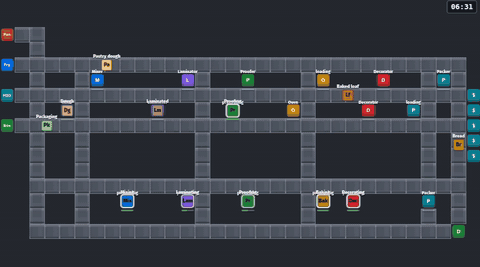
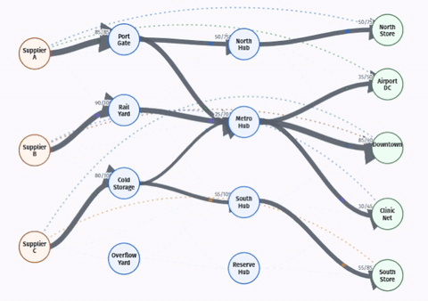
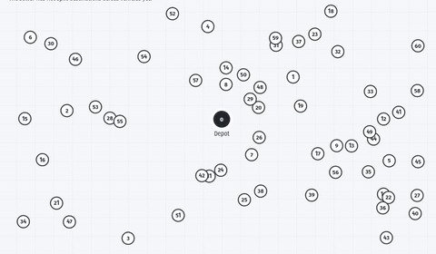
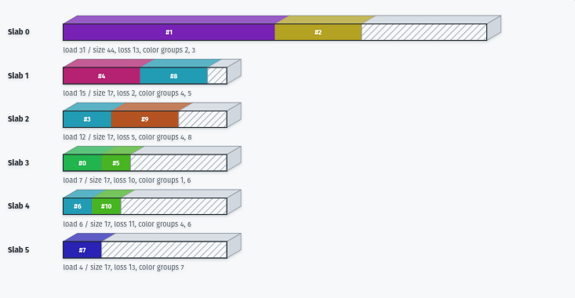

# Google OR-Tools for Web

Solve complex optimization models from TypeScript with Google OR-Tools running
as multithreaded WebAssembly.

[](https://github.com/Axelwickm/or-tools-wasm)
[](https://www.npmjs.com/package/or-tools-wasm)

[](https://github.com/Axelwickm/or-tools-wasm/actions/workflows/package.yml)
[](https://github.com/Axelwickm/or-tools-wasm/actions/workflows/package.yml)
[](https://github.com/Axelwickm/or-tools-wasm/actions/workflows/package.yml)
[](https://github.com/Axelwickm/or-tools-wasm/actions/workflows/package.yml)
[](https://github.com/Axelwickm/or-tools-wasm/actions/workflows/package.yml)
[](https://github.com/Axelwickm/or-tools-wasm/actions/workflows/package.yml)
[](https://github.com/Axelwickm/or-tools-wasm/actions/workflows/package.yml)
[](https://github.com/Axelwickm/or-tools-wasm/actions/workflows/package.yml)
[](https://github.com/Axelwickm/or-tools-wasm/actions/workflows/package.yml)
[](https://github.com/Axelwickm/or-tools-wasm/actions/workflows/package.yml)
[](https://github.com/Axelwickm/or-tools-wasm/actions/workflows/package.yml)
[](https://github.com/Axelwickm/or-tools-wasm/actions/workflows/package.yml)
[](https://github.com/Axelwickm/or-tools-wasm/actions/workflows/package.yml)
[](https://github.com/Axelwickm/or-tools-wasm/actions/workflows/package.yml)

[Try online in your browser](https://axelwickman.com/or-tools-wasm?utm_source=or-tools-wasm&utm_medium=readme&utm_campaign=try_online)

Used in [PragmaPlanner](https://pragmaplanner.com/?utm_source=or-tools-wasm&utm_medium=readme&utm_campaign=used_in)

<p>
  
  
</p>
<p>
  
  
  
</p>

## Usage

Run the local test site:

```sh
npm --prefix package install
npm --prefix package run dev
```

Install from npm:

```sh
npm install or-tools-wasm
```

> [!WARNING]
> Browser builds require cross-origin isolation headers for WebAssembly threads.
> See [Browser requirements](#browser-requirements) below.

Public solver APIs live under solver-scoped subpaths:

```ts
import { CpModel, CpSolver } from 'or-tools-wasm/cp-sat';
import { RoutingIndexManager, RoutingModel } from 'or-tools-wasm/routing';
import { MPSolver } from 'or-tools-wasm/mp-solver';
import { MathOpt } from 'or-tools-wasm/mathopt';
import { Pdlp } from 'or-tools-wasm/pdlp';
import { KnapsackSolver } from 'or-tools-wasm/knapsack';
import { SimpleMaxFlow } from 'or-tools-wasm/network-flow';
import { SetCoverModel } from 'or-tools-wasm/set-cover';
import { RcpspModelBuilder } from 'or-tools-wasm/rcpsp';
```

Build a CP-SAT model and solve it:

```ts
const model = new CpModel();

const desks = model.newIntVar(0, 4, 'desks');
const tables = model.newIntVar(0, 3, 'tables');

model.addLinearConstraint(desks.times(3).plus(tables.times(4)), 0, 12);
model.maximize(desks.times(20).plus(tables.times(30)));

const solver = new CpSolver();
const status = await solver.solve(model, { numSearchWorkers: 1 });

console.log(solver.statusName(status));
console.log({
  desks: solver.value(desks),
  tables: solver.value(tables),
  profit: solver.objectiveValue(),
});
```

## API reference

See [docs/api.md](docs/api.md) for the full TypeScript API reference.

## Benchmarking

See [benchmarking/](benchmarking/).

## Supported OR-Tools surface

| OR-Tools surface | or-tools-wasm | Description |
| --- | --- | --- |
| CP-SAT | ✅ | Constraint and integer optimization for Boolean, integer, scheduling, and logical models. |
| Routing | ✅ | Vehicle routing (VRP), TSP, pickup-delivery, capacity, dimension, and time-window search. |
| MPSolver API | ✅ | Linear and mixed-integer programming wrapper; this package includes GLOP LP, CLP LP, GLPK LP/MIP, SCIP MIP, CBC MIP, BOP MIP, Knapsack MIP, and SAT MIP backends. |
| MathOpt API | ✅ | Unified modeling and solve API with incremental solving and callback support; this package includes GLOP, GLPK, GSCIP, CP-SAT, and PDLP backends. |
| GLOP | ✅ | Google's simplex linear programming solver. |
| PDLP | ✅ | First-order LP and convex diagonal quadratic solver for very large models. |
| SAT integer programming | ✅ | CP-SAT-backed integer programming backend for pure integer linear models. |
| CLP | ✅ | COIN-OR linear programming backend. |
| GLPK | ✅ | GNU linear and mixed-integer programming backend. |
| SCIP / GSCIP | ✅ | SCIP-based mixed-integer backend through MPSolver and MathOpt. |
| CBC | ✅ | COIN-OR branch-and-cut mixed-integer programming backend through MPSolver. |
| BOP | ✅ | Boolean/integer optimization backend through MPSolver. |
| Knapsack | ✅ | Dedicated 0-1 and multi-dimensional knapsack solver, plus the MPSolver Knapsack backend. |
| Network flow algorithms | ✅ | Dedicated max-flow, min-cost-flow, and linear-sum assignment graph algorithms. |
| Assignment algorithms | ✅ | Linear-sum assignment through the dedicated Network Flow API. |
| Set cover | ✅ | Dedicated weighted set cover model, invariant, and heuristic search API. |
| RCPSP | ✅ | CP-SAT-backed resource-constrained project scheduling model, parser, and visual scheduling surface. |
| Linear Solver ModelBuilder |  | Ergonomic LP/MIP modeling API with import/export helpers and backend solve helpers. |

Unchecked rows are planned OR-Tools targets that are not exposed by this package
yet. Commercial and large third-party native backends such as Gurobi, CPLEX,
XPRESS, HiGHS, OSQP, ECOS, and SCS are not planned.

The TypeScript API mirrors the public OR-Tools Python API shape where it maps
cleanly to WebAssembly, and the fixture suite tracks Python API behavior for
the exposed solver surfaces. CP-SAT exposes both a high-level builder and the
proto-first `CpSat` API, routing exposes the familiar `RoutingIndexManager` and
`RoutingModel` APIs, MPSolver exposes the `pywraplp`-style solver API, and
MathOpt exposes a TypeScript model builder.

The worker script and WebAssembly files are emitted automatically from package
imports, with no manual copying into `public/` or `static/` required.

## Fixture test matrix

Run the full fixture matrix:

```sh
npm --prefix package run test:fixtures
```

This runs the shared solver cases through Vite, Webpack, Rollup, Deno, Node,
and Bun. Browser fixtures cover dev and static serving where the bundler
supports both, Chromium and Firefox, direct runtime execution, the browser
worker bridge, and solver thread settings where supported.

For focused iteration:

```sh
npm --prefix package run test:fixtures:browser
npm --prefix package run test:fixtures:runtime
npm --prefix package run test:fixture:node
```

Run the full matrix before landing solver API, worker bridge, threading, or
packaging changes.

## Browser requirements

Browser builds use WebAssembly threads, so pages must be served with
cross-origin isolation enabled:

```http
Cross-Origin-Opener-Policy: same-origin
Cross-Origin-Embedder-Policy: require-corp
```

Without these headers, solving can fail during WebAssembly runtime or worker
startup.

See [Bundler configuration](#bundler-configuration) for Vite, Webpack, and
Rollup setup.

## Bundler configuration

See [docs/bundlers.md](docs/bundlers.md) for Vite, Webpack, and Rollup setup.

## Node, Deno, and Bun

Node and Bun work with normal ESM imports and do not need browser
cross-origin-isolation headers.

Deno needs permissions to read package assets and inspect CPU count:

```sh
deno run --allow-read --allow-sys=cpus your-script.ts
```

Node uses the JSPI runtime when `WebAssembly.promising` is available and falls
back to Asyncify otherwise. Deno and Bun use the package's Asyncify runtime
path.

## Upstream OR-Tools

This repository vendors Google OR-Tools and adds a JavaScript/WebAssembly
packaging layer on top. OR-Tools is Google's open-source suite for solving
combinatorial optimization problems, including CP-SAT, linear programming,
routing, bin packing, and graph algorithms.

Upstream project:

- Source: [github.com/google/or-tools](https://github.com/google/or-tools)
- Documentation: [developers.google.com/optimization](https://developers.google.com/optimization/)
- License: Apache License 2.0

## Maintainer

Maintained by [Axel Wickman](https://axelwickman.com).

## License

This project is licensed under the Apache License 2.0. See [LICENSE](LICENSE).
