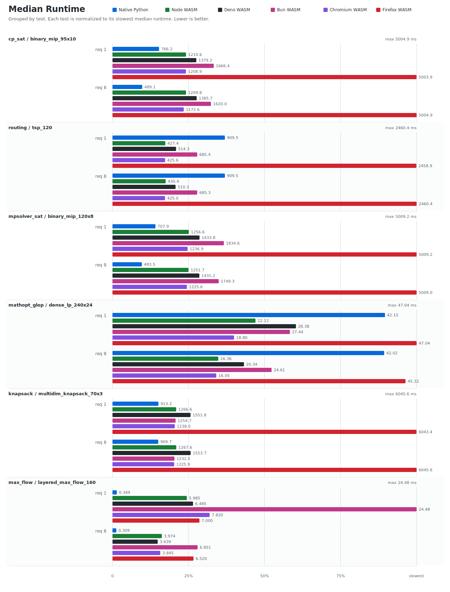

# OR-Tools Benchmarking

Run the benchmark suite:

```sh
benchmarking/run.sh
```

This packs the local npm package, runs the Docker benchmarks, writes CSVs under `benchmarking/results/`, and refreshes this report. To rerender existing CSVs only:

```sh
python3 benchmarking/scripts/render_results.py
```

<!-- benchmark-report:start -->
## Latest Results

Generated by `python3 benchmarking/scripts/render_results.py` from `benchmarking/results/*.csv`.
Values are medians across recorded runs after the unrecorded warmup solve.

Source CSVs: `native-python.csv`, `wasm-bun.csv`, `wasm-deno.csv`, `wasm-node.csv`, `web-chromium.csv`, `web-firefox.csv`. Git SHA: `3079908cb0`. OR-Tools versions: Native Python `9.15.6755`; Node WASM `9.15`; Deno WASM `9.15`; Bun WASM `9.15`; Chromium WASM `9.15`; Firefox WASM `9.15`.



| Suite | Solver | Problem | Requested threads | Native Python ms | Node WASM ms | Deno WASM ms | Bun WASM ms | Chromium WASM ms | Firefox WASM ms |
| --- | --- | --- | ---: | ---: | ---: | ---: | ---: | ---: | ---: |
| core | cp_sat | binary_mip_95x10 | 1 | 766.2 | 1210.6 | 1379.2 | 1666.4 | 1208.9 | 5003.9 |
| core | cp_sat | binary_mip_95x10 | 8 | 489.1 | 1209.8 | 1385.7 | 1620.0 | 1172.6 | 5004.9 |
| core | routing | tsp_120 | 1 | 909.5 | 427.4 | 514.3 | 685.4 | 425.6 | 2458.9 |
| core | routing | tsp_120 | 8 | 909.5 | 430.4 | 510.3 | 685.3 | 425.0 | 2460.4 |
| core | mpsolver_sat | binary_mip_120x8 | 1 | 707.9 | 1256.6 | 1433.8 | 1834.6 | 1236.9 | 5009.2 |
| core | mpsolver_sat | binary_mip_120x8 | 8 | 483.5 | 1251.7 | 1431.2 | 1749.3 | 1225.6 | 5009.0 |
| core | mathopt_glop | dense_lp_240x24 | 1 | 42.15 | 22.12 | 28.38 | 27.44 | 18.80 | 47.04 |
| core | mathopt_glop | dense_lp_240x24 | 8 | 42.02 | 16.36 | 20.34 | 24.61 | 16.05 | 45.32 |
| core | knapsack | multidim_knapsack_70x3 | 1 | 913.2 | 1266.6 | 1551.8 | 1254.7 | 1238.0 | 6043.4 |
| core | knapsack | multidim_knapsack_70x3 | 8 | 909.7 | 1267.6 | 1553.7 | 1232.5 | 1225.9 | 6045.6 |
| core | max_flow | layered_max_flow_160 | 1 | 0.349 | 5.985 | 6.485 | 24.48 | 7.820 | 7.000 |
| core | max_flow | layered_max_flow_160 | 8 | 0.309 | 3.974 | 3.639 | 6.851 | 3.845 | 6.520 |
<!-- benchmark-report:end -->

Suite definitions live in `suites.json`.
